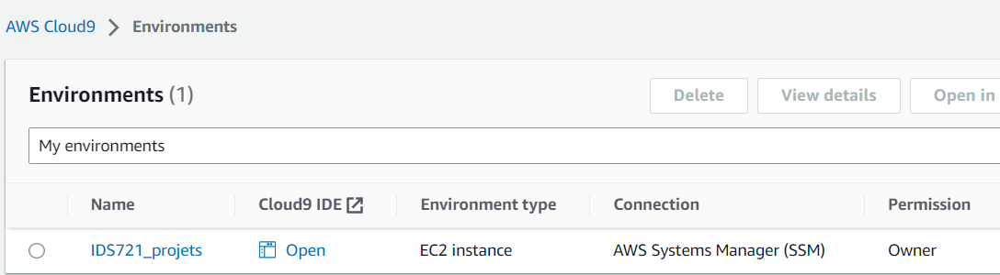
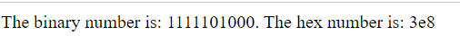

# IDS 721 project 1 -- Microservice deployed on cloud 

## Overview
Deployed a simple decimal converter on the AWS platform

## Works
- Apply Flask to create a python app on AWS EC2 cloud platform
- Use AWS Cloud9 as laC to deploy the app


## Usage
This app is running on my server at port 5000, the public url of my server is ec2-18-205-26-232.compute-1.amazonaws.com.

- You can visit this link: 
```
ec2-18-205-26-232.compute-1.amazonaws.com:5000
```
You should see 
  ``` 
        Hey, It's Shuhao's server!
  ```
by click on this link.

- To use this service you use the url in the format of 
```
ec2-18-205-26-232.compute-1.amazonaws.com:5000/try/<number you want to check>.
```
- For example: 
```
ec2-18-205-26-232.compute-1.amazonaws.com:5000/try/1000. 
```
You should see:

