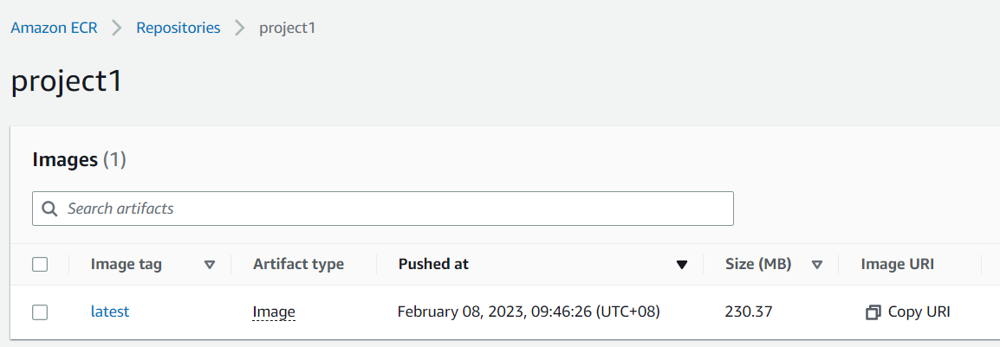
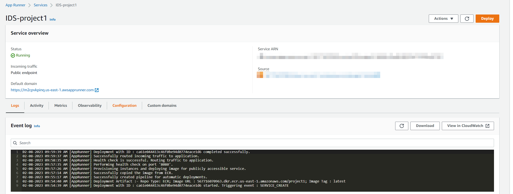
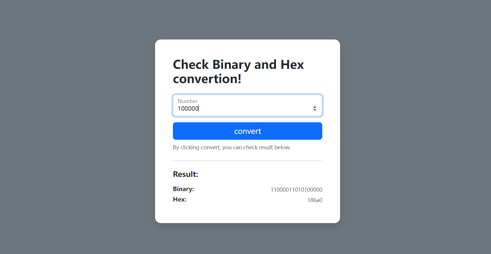

# IDS 721 project 1 -- Microservice deployed on cloud 

## Overview
Deployed a simple decimal converter on the AWS platform. You can check the binary and hex format of the decimal input. A graphical UI is provided.

## Works
- Apply Flask to create a python app on AWS EC2 cloud platform
- The app is deployed using docker, the docker image is built and pushed to the EC repository

- Create micro-service on aws app runner, it will automatically deployed the service whenever the docker images is modified.

## Usage
This service is available at https://m2cpvkpinq.us-east-1.awsapprunner.com/

## The screen shot of this service

